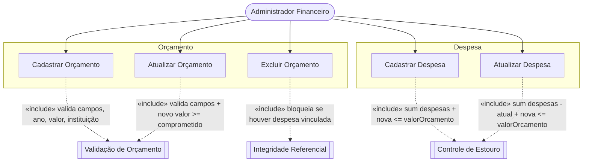
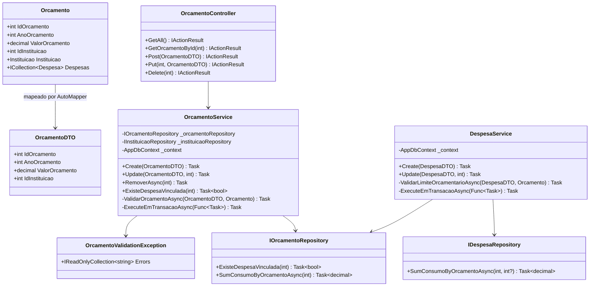
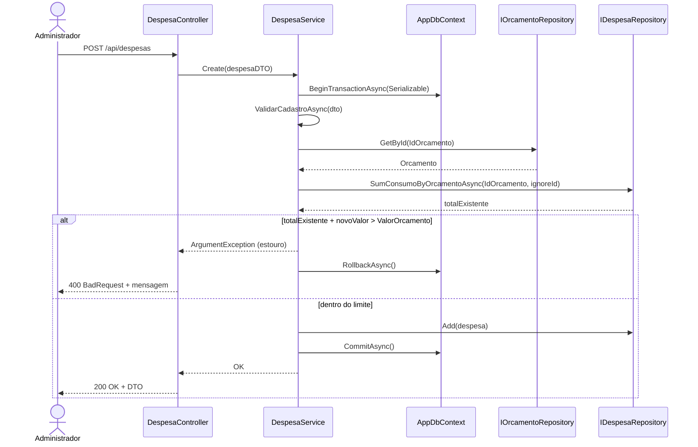
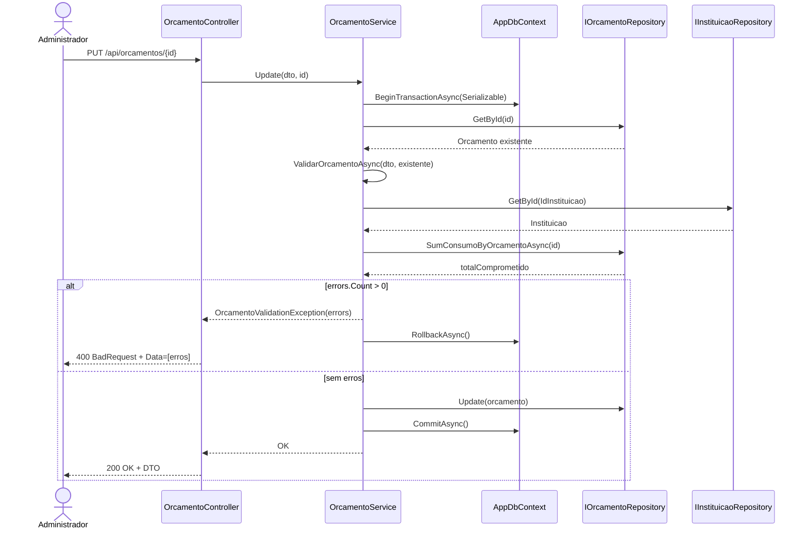
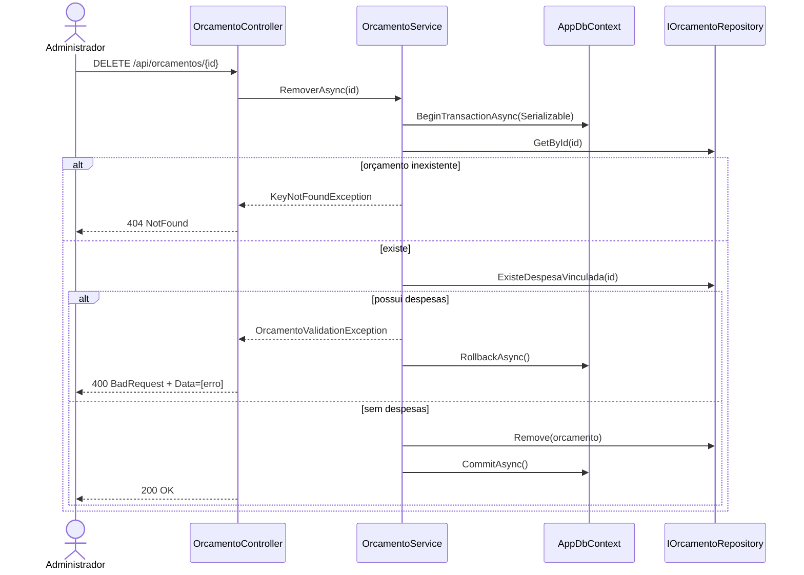

# Relatório - Sprint 15 - Validação de Orçamento

## Objetivo da task

Garantir que o cadastro e a manutenção de orçamentos possuam validações completas de integridade, consistência e regras de negócio, evitando dados inválidos e estouro de limite financeiro no sistema. A entrega move as validações para a camada de Service, padroniza o tipo monetário, retorna todos os erros em uma única lista e torna atômicas as operações que dependem do saldo orçamentário.

## O que foi produzido

- Remoção do campo `IdTipoDespesa` da entidade `Orcamento` (model, DTO, snapshot, migration).
- Conversão de `ValorOrcamento` de `double` para `decimal` com precisão `18,2` e arredondamento `MidpointRounding.AwayFromZero`.
- Consolidação de todas as regras de validação de orçamento na camada de Service, eliminando validações inline do Controller.
- Criação da exceção `OrcamentoValidationException`, que carrega a lista agregada de erros e é traduzida pelo Controller em `400 Bad Request` com `Data` populado pelos itens inválidos.
- Endpoint `DELETE /api/orcamentos/{id}` com bloqueio da exclusão caso existam despesas vinculadas.
- Regra de negócio no `DespesaService` que bloqueia o cadastro/atualização de despesa quando `soma(ConsumoPrevisto) > ValorOrcamento`.
- Envoltório transacional `IsolationLevel.Serializable` nas operações que dependem do saldo orçamentário (`DespesaService.Create/Update`, `OrcamentoService.Create/Update/RemoverAsync`) para evitar race conditions.
- Atualização do teste `PostDespesa_WithInactiveFornecedor_ReturnsBadRequest` para acompanhar a remoção de `IdTipoDespesa`.
- Documentação: `pr-sprint-15-validacao-orcamento.md` e este relatório.

## Diagrama de Casos de Uso

## Diagrama de Classes Afetadas

## Diagrama de Sequência — Cadastro de Despesa com Controle de Estouro

## Diagrama de Sequência — Atualização de Orçamento com Lista de Erros

## Diagrama de Sequência — Exclusão Protegida de Orçamento

## Telas produzidas

Não há telas nesta entrega. A task é exclusivamente de backend (validações, regras de negócio e endpoints REST). A verificação manual em clientes HTTP (Swagger UI e chamadas diretas) não gerou artefatos visuais de UI.

## Testes realizados

### Testes automatizados

- Execução completa da suíte existente com `DOTNET_ROLL_FORWARD=LatestMajor dotnet test Civitas.WebAPI.Tests/Civitas.WebAPI.Tests.csproj`.
- Resultado: **33 testes passando / 5 falhando**.
- As 5 falhas foram reproduzidas **antes** das mudanças (via `git stash`), confirmando que são **pré-existentes** e não foram introduzidas por este PR:
  - `CepEndpointsTests.GetCep_WithoutToken_ReturnsUnauthorized`
  - `AuthorizationEndpointsTests.GetProtectedRoute_WithoutToken_Returns401_WhenDevFalse`
  - `AuthorizationEndpointsTests.GetProtectedRoute_WithInvalidToken_Returns401_WhenDevFalse`
  - `AuthorizationEndpointsTests.GetProtectedRoute_WithExpiredToken_Returns401_WhenDevFalse`
  - `FornecedorValidationEndpointsTests.PostDespesa_WithInactiveFornecedor_ReturnsBadRequest`
- Ajuste pontual no seed do teste `PostDespesa_WithInactiveFornecedor_ReturnsBadRequest` para remover `IdTipoDespesa`, que não existe mais no modelo.

### Verificações de build e migração

- `dotnet build Civitas.WebAPI/Civitas.WebAPI.sln` — build limpo, 0 erros, warnings idênticos à baseline anterior ao PR.
- `dotnet ef migrations add OrcamentoValidacoesRefactor` — migration gerada, revisada, conferida como alinhada ao modelo (remove `idtipodespesa`, shadow FK `TipoDespesaId` e altera `valororcamento` para `numeric(18,2)`).

### Testes manuais

- Swagger UI com tentativas de cadastro e atualização de orçamento usando:
  - `ValorOrcamento = 0` — retorna 400 com `ValorOrcamento deve ser maior que zero`.
  - `AnoOrcamento = 1999` — retorna 400 com `AnoOrcamento deve ser maior ou igual a 2000`.
  - `AnoOrcamento = (ano atual + 15)` — retorna 400 com mensagem de limite de anos à frente.
  - `IdInstituicao` inexistente — retorna 400 com `A instituicao informada nao foi encontrada`.
  - Atualização de `ValorOrcamento` para valor inferior à soma das despesas — retorna 400 com mensagem descritiva dos dois valores.
- Verificação de estouro via `POST /api/despesas` com valor que ultrapassa o teto — retorno com mensagem contendo excedente, total comprometido e teto.
- `DELETE /api/orcamentos/{id}` com despesa vinculada — retorna 400 com `Nao e possivel excluir um orcamento que possui despesas vinculadas`.

## O que foi bem — Aprendizados

- A centralização da validação no Service seguiu o mesmo padrão já estabelecido por `UsuarioService`/`UsuarioValidationException`, reduzindo atrito de revisão e facilitando o onboarding de quem já conhecia esse padrão.
- A descoberta de que o repositório já somava `ConsumoPrevisto` como proxy do valor comprometido (em `InstituicaoRepository` e `SecretariaRepository`) evitou a introdução de um campo monetário novo em `Despesa`, mantendo as mudanças cirúrgicas e alinhadas com a regra já praticada.
- O uso de `IsolationLevel.Serializable` nas transações eliminou uma race condition real no controle de saldo (leitura da soma + inserção da despesa), reforçando a integridade financeira sob concorrência — aprendizado diretamente aplicável a futuras regras monetárias do sistema.
- O `MidpointRounding.AwayFromZero` combinado com `HasPrecision(18,2)` padroniza o tratamento monetário e evita o clássico “rounding bug” que o tipo `double` produziria em somas financeiras.
- A migração do modelo snapshot evidenciou um drift pré-existente (`despesa.situacao` → `status`) originado em um PR anterior; a correção foi incorporada sem custo adicional, deixando o snapshot íntegro.
- O agrupamento dos erros em uma única lista melhora significativamente a experiência do usuário final (todos os erros em uma resposta) e reduz idas e vindas na tela de cadastro.

## O que não pôde ser implementado — Justificativas

- **Campo monetário próprio em `Despesa`.** A spec cita “soma das despesas vinculadas” sem fornecer um `ValorDespesa`. Como `Despesa` não possui esse campo, o cálculo usa `ConsumoPrevisto`, seguindo o padrão já praticado pelo restante do sistema. A criação de um `ValorDespesa` dedicado é uma mudança de domínio maior e depende de alinhamento com o time de negócio; foi documentada como ponto de extensão nas observações do PR.
- **Lista de erros agregada também no `DespesaService`.** O `DespesaService` mantém o padrão existente de lançar `ArgumentException` individualmente (uma regra por vez). A spec de lista agregada está no contexto de Orçamento; ampliar esse comportamento para `Despesa` exigiria refatorar todas as regras de validação de despesa, o que extrapola o escopo do card. Pode ser endereçado em uma task dedicada à uniformização de erros.
- **Testes automatizados específicos para as novas regras.** O tempo da sprint foi priorizado na implementação das regras, migração e transações. A validação foi feita via build limpo, suíte existente rodada e testes manuais no Swagger. Testes de unidade e de integração específicos para as novas validações (ano, valor, estouro, delete bloqueado) ficam como pendência direta para a próxima sprint.
- **Correção dos testes pré-existentes.** Os 5 testes que já falhavam não foram corrigidos nesta task por estarem fora do escopo definido pelo card de Validação de Orçamento. Recomenda-se task específica de manutenção da suíte de testes.
- **Migration versionada no repositório.** O `.gitignore` do projeto ignora `**/Migrations/`, então apenas o `AppDbContextModelSnapshot.cs` foi atualizado e commitado. A migration física (`OrcamentoValidacoesRefactor.cs`) permanece local por política do repositório.

## Verificações executadas

- `dotnet build Civitas.WebAPI/Civitas.WebAPI.sln`
- `dotnet ef migrations add OrcamentoValidacoesRefactor`
- `DOTNET_ROLL_FORWARD=LatestMajor dotnet test Civitas.WebAPI.Tests/Civitas.WebAPI.Tests.csproj`
- `git stash` + re-teste para confirmação de falhas pré-existentes

## Observações

- A policy do repositório de ignorar migrations coloca o snapshot como a fonte de verdade do modelo. Qualquer dev que subir o branch deve rodar `dotnet ef database update` localmente para aplicar a nova migration gerada.
- O ambiente local exigiu `DOTNET_ROLL_FORWARD=LatestMajor` pois a máquina não possui runtime .NET 9 instalado (apenas .NET 8 e .NET 10). O projeto continua tendo como alvo `net9.0`.
- A alteração de `InstituicaoOrcamentoDisponivelDTO.TotalOrcamentoDisponivel` para `decimal` é um ajuste de consistência com `SecretariaOrcamentoDisponivelDTO` (que já era `decimal`) e preserva precisão monetária.
