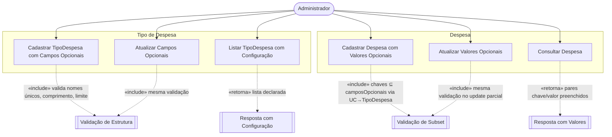
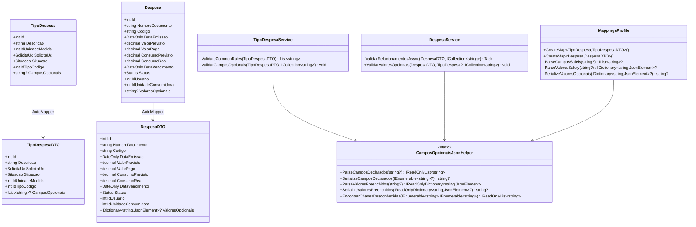
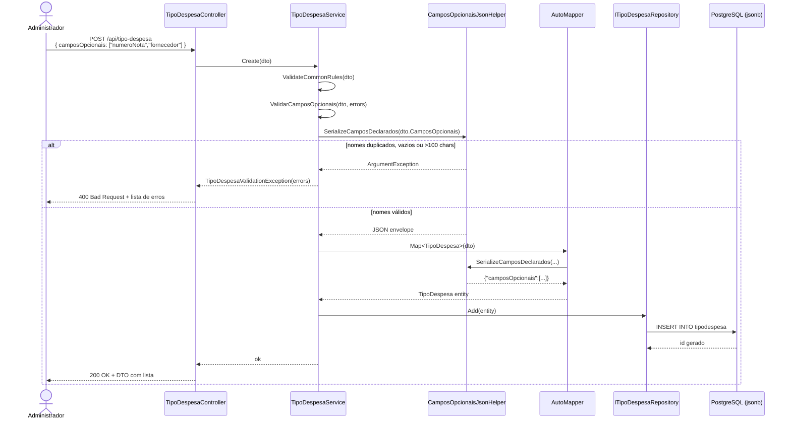
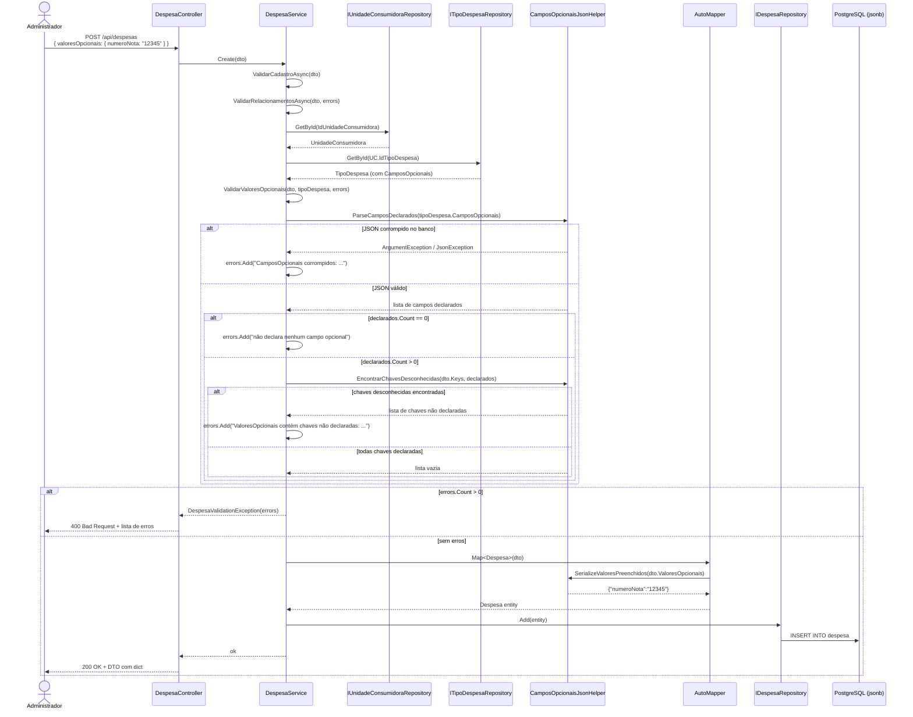
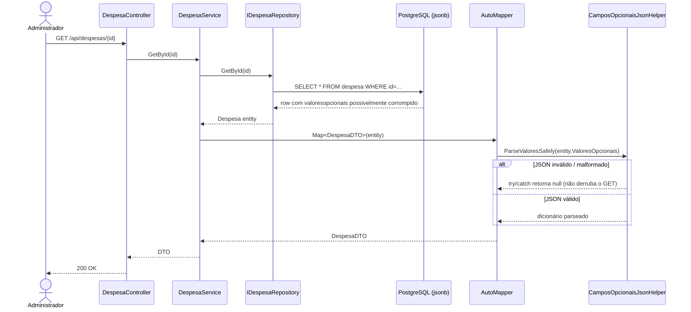

# Relatório - Sprint 17 - Campos Opcionais Dinâmicos com JSONB

## Objetivo da task

Permitir que cada `TipoDespesa` declare uma lista de campos opcionais configuráveis dinamicamente, e que cada `Despesa` armazene valores correspondentes para esses campos, ambos persistidos como `JSONB` no PostgreSQL. A entrega flexibiliza o cadastro sem exigir alteração estrutural no banco a cada novo campo, mantém compatibilidade total com a estrutura atual do sistema, garante integridade entre os campos declarados e os valores preenchidos, e centraliza as validações na camada de Service.

## O que foi produzido

- Nova propriedade `CamposOpcionais` (`string?`) na entidade `TipoDespesa`, mapeada para a coluna `camposopcionais` (JSONB) e armazenando o envelope `{"camposOpcionais":[...]}`.
- Nova propriedade `ValoresOpcionais` (`string?`) na entidade `Despesa`, mapeada para a coluna `valoresopcionais` (JSONB) e armazenando um objeto JSON plano com pares chave/valor.
- DTOs ajustados para expor superfície de API limpa: `IList<string>?` em `TipoDespesaDTO.CamposOpcionais` e `IDictionary<string, JsonElement>?` em `DespesaDTO.ValoresOpcionais`.
- Helper estático puro `CamposOpcionaisJsonHelper`, isolando a lógica de parsing, serialização e validação de subset, sem qualquer dependência de DB ou framework web.
- Configuração customizada de AutoMapper para serializar/desserializar JSON entre Model e DTO, com leitura defensiva (parse error em registro corrompido não derruba o GET) e escrita estrita (validação roda upstream no Service).
- Validação de estrutura no `TipoDespesaService` (nomes únicos case-insensitive, comprimento ≤ 100, no máximo 50 campos), integrada ao fluxo existente de `ValidateCommonRules` e cobrindo automaticamente `Create` e `Update`.
- Validação de subset no `DespesaService.ValidarValoresOpcionais`, executada dentro de `ValidarRelacionamentosAsync`. Resolve o `TipoDespesa` via `Despesa → UnidadeConsumidora → TipoDespesa` e garante que toda chave preenchida em `ValoresOpcionais` esteja declarada em `TipoDespesa.CamposOpcionais`. Cobre também os cenários de `TipoDespesa` ausente, `CamposOpcionais` corrompido no banco e `TipoDespesa` que não declara nenhum campo opcional.
- 17 testes unitários em `CamposOpcionaisHelperTests.cs` cobrindo parsing, serialização, duplicatas, malformação, valores nulos e a verificação de subset.
- 8 testes diretos em `DespesaValoresOpcionaisValidationTests.cs` para a orquestração no Service, expostos via `InternalsVisibleTo`. Os testes evitam a complexidade de seedar 8 entidades para um teste de integração full-stack, focando exclusivamente na lógica de validação adicionada na sprint.
- Script SQL standalone `Civitas.WebAPI/sql/add_campos_opcionais_jsonb.sql` com `ALTER TABLE ... ADD COLUMN IF NOT EXISTS ... jsonb` para `tipodespesa` e `despesa`. Idempotente, NULL-able (retrocompatível) e alinhado com a política do repositório de não versionar migrations EF.
- Documentação inline (XML doc) descrevendo formato esperado em ambos os modelos e a assimetria deliberada de case-sensitivity entre dedup de declaração (case-insensitive) e match de subset (case-sensitive).

## Diagrama de Casos de Uso

## Diagrama de Classes Afetadas

## Diagrama de Sequência — Cadastro de TipoDespesa com Campos Opcionais

## Diagrama de Sequência — Cadastro de Despesa com Validação de Subset

## Diagrama de Sequência — Leitura Defensiva (GET) de Registro com JSON Corrompido

## Telas produzidas

Não há telas nesta entrega. A task é exclusivamente de backend (modelagem JSONB, validações, regras de negócio, AutoMapper e endpoints REST). A verificação manual em cliente HTTP (curl direto contra a API rodando localmente em Postgres) gerou os retornos JSON utilizados como evidência, descritos na seção de Testes realizados.

## Testes realizados

### Testes automatizados

- **17 testes unitários do helper** em `CamposOpcionaisHelperTests.cs`, cobrindo:
  - Parsing do envelope (válido, sem chave, não-array, duplicatas, vazio, não-string, malformado).
  - Serialização (null, vazio, válido, duplicata).
  - Parsing de valores preenchidos (null/whitespace, objeto válido, não-objeto).
  - `EncontrarChavesDesconhecidas` (todas conhecidas, algumas desconhecidas, case sensitivity).
- **8 testes diretos da orquestração de subset** em `DespesaValoresOpcionaisValidationTests.cs`, expostos via `InternalsVisibleTo`. Cobrem:
  - `ValoresOpcionais` null e vazio (não adiciona erro).
  - `TipoDespesa` ausente (erro específico).
  - `TipoDespesa` sem campos declarados (erro específico).
  - `TipoDespesa.CamposOpcionais` corrompido no banco (erro "corrompidos").
  - Todas chaves declaradas (sem erro).
  - Chaves desconhecidas (todas listadas na mensagem).
  - Case sensitivity (`NumeroNota` ≠ `numeroNota`).
- A execução local da suíte foi limitada pelo ambiente: a máquina de desenvolvimento possui apenas runtimes .NET 8 e .NET 10 instalados, sem o runtime .NET 9 exigido pelo projeto. A suíte construída compila limpa; a execução completa fica delegada ao CI ou ao ambiente do dev que tenha o runtime correto.

### Verificações de build

- `dotnet build Civitas.WebAPI/Civitas.WebAPI.csproj` — build limpo, 0 erros, 99 warnings (todos pré-existentes, nenhum introduzido pelas mudanças desta sprint).
- `dotnet build Civitas.WebAPI/Civitas.WebAPI.sln` — build da solução completa (WebAPI + Tests) limpo, 0 erros.

### Smoke test funcional em ambiente real

Foi orquestrado um ambiente local completo para validar end-to-end:

1. Container Docker `postgres:16` subido com as credenciais do `appsettings.json` (`localhost:5432`, db `civitas`, user `postgres`, senha `123456`).
2. Aplicação subida via `DOTNET_ROLL_FORWARD=Major ASPNETCORE_ENVIRONMENT=Development` para contornar a ausência do runtime .NET 9 local.
3. Schema criado pela aplicação ao subir e seed populado.
4. Aplicação do script SQL `add_campos_opcionais_jsonb.sql` confirmando que o DDL é aceito pelo Postgres e que as colunas ficam como `jsonb`.
5. Testes funcionais via `curl` autenticado com JWT do usuário admin de seed:

| # | Cenário | Verificação | Resultado |
|---|---|---|---|
| 1 | `GET /api/tipo-despesa?page=1&size=2` | Lista retorna `camposOpcionais: []` em registros sem configuração | OK |
| 2 | `POST /api/tipo-despesa` com `camposOpcionais: ["numeroNota","fornecedor","centroCusto"]` | Criado, lista retornada no body | OK |
| 3 | `GET /api/tipo-despesa/{id}` | `camposOpcionais` presente no body | OK |
| 4 | `POST /api/tipo-despesa` com `camposOpcionais: ["a","a"]` (duplicata) | 400 + `Nome de campo opcional duplicado: 'a'` | OK |
| 5 | `PUT /api/tipo-despesa/{id}` alterando `camposOpcionais` | Atualizado | OK |
| 6 | `POST /api/despesas` com `valoresOpcionais: {numeroNota:"12345",fornecedor:"Papelaria"}` | Criado, dict retornado | OK |
| 7 | `GET /api/despesas/{id}` | `valoresOpcionais` presente no body | OK |
| 8 | `POST /api/despesas` com `valoresOpcionais: {chaveDesconhecida:"X"}` | 400 + `ValoresOpcionais contém chaves não declaradas em TipoDespesa: chaveDesconhecida` | OK |
| 9 | `PUT /api/despesas/{id}` com update parcial de `valoresOpcionais` | Atualizado, dict reduzido | OK |

Verificações adicionais via `psql` direto no container PostgreSQL:

- Operador jsonb `->>` extrai campos do objeto (`numeroNota → "12345"`, `centroCusto → NULL`).
- INSERTs sem as novas colunas geram registros com `NULL` (retrocompatibilidade).
- O Postgres rejeita JSON malformado nativamente (validação dupla além do helper).

### Code review

- Revisores automatizados (subagentes especializados em spec compliance e code quality) aprovaram cada commit individualmente, e um revisor final aprovou o conjunto da branch antes do push.
- Apontamentos minor identificados durante o review foram aplicados em commits dedicados (ex.: doc XML do `paramref` corrigido, comentário documentando assimetria de case-sensitivity adicionado).

## O que foi bem — Aprendizados

- A separação rigorosa entre helper puro (`CamposOpcionaisJsonHelper`) e camadas de orquestração (Service, Mapper) permitiu testar de forma intensiva (17 + 8 testes) sem necessidade de mocks ou fixtures complexas. O helper é stateless, não tem dependência de DI, e cada método tem um único contrato verificável.
- A escolha de armazenar o JSON como `string?` raw no model — em vez de `Dictionary<string, object>` ou `JsonDocument` — manteve a entidade trivial e provedor-agnóstica, permitindo que o mesmo modelo rode em PostgreSQL (jsonb) em produção e SQLite (text) em testes sem condicionais ou shims.
- A validação na leitura ser **defensiva** (try/catch retorna null no Mapper) e na escrita ser **estrita** (Service valida e lança exceção amigável antes do mapper) é um padrão limpo: registros corrompidos no banco não derrubam GETs, mas escrita inválida produz mensagens claras.
- A descoberta de que o time gitignora migrations EF intencionalmente (`**/Migrations/`) levou à decisão de entregar a alteração de schema como SQL DDL standalone em `Civitas.WebAPI/sql/add_campos_opcionais_jsonb.sql`, alinhada à pasta `sql/` que já existia no projeto. Esse caminho respeita a política do time, é versionado, e o operador roda manualmente com clareza do que está aplicando.
- A reutilização do helper `SerializeCamposDeclarados` para validar o input do `TipoDespesa` (via `try/catch` no Service) eliminou duplicação: as mesmas regras de unicidade, comprimento e limite de quantidade são aplicadas tanto na fronteira de entrada quanto no parse de leitura.
- O smoke test end-to-end em ambiente real (Postgres em Docker + app via roll-forward) provou que o caminho completo `JSON do request → DTO → AutoMapper → Model → Postgres jsonb → Model → DTO → JSON do response` funciona sem perda de informação, e que mensagens de erro chegam ao cliente em português com contexto suficiente para corrigir a entrada.
- A prática de rodar duas etapas de revisão por commit (spec compliance, depois code quality) detectou desvios pequenos antes que se acumulassem (ex.: implementador trocou `TargetFramework net9.0` por `net10.0` no projeto de testes para contornar a ausência do runtime — desvio revertido imediatamente).

## O que não pôde ser implementado — Justificativas

- **Migration EF versionada no repositório.** O `.gitignore` do projeto contém `**/Migrations/` e existem dois commits anteriores do time removendo migrations do controle de versão (`devops: removendo migrations`, `chore: Remove Migrations do controle de versão`). Adicionalmente, ao tentar gerar a migration via `dotnet ef migrations add`, o EF detectou drift entre o snapshot do último commit e o modelo atual (resultando numa migration de 585 linhas com 14 `CreateTable`, inaplicável contra qualquer banco existente). Por respeito à política do time e por integridade técnica, a alteração de schema foi entregue como SQL DDL standalone em `Civitas.WebAPI/sql/add_campos_opcionais_jsonb.sql`. A correção do drift do snapshot é um item separado, fora do escopo do card.
- **Tipo de coluna `jsonb` no EF builder.** Os builders configuram apenas `HasColumnName`, sem `HasColumnType("jsonb")`. Em produção a coluna nasce como `jsonb` via SQL DDL; em SQLite (testes) a coluna nasce como `text`. Adicionar `HasColumnType("jsonb")` no builder quebraria os testes SQLite, e a solução condicional por provedor extrapola o escopo desta sprint. Na prática a aplicação manipula JSON sempre como string em C#, então o tipo da coluna é irrelevante para o código — apenas para operadores nativos jsonb do Postgres, que não são usados ainda.
- **Testes de integração full-stack via `DespesaService.Create`.** A criação de uma `Despesa` válida exige seedar oito entidades correlatas (`Usuario`, `Instituicao`, `Fornecedor`, `Secretaria`, `TipoCodigo`, `UnidadeMedida`, `TipoDespesa`, `Orcamento`, `UnidadeConsumidora`), cada uma com seus próprios campos obrigatórios e relacionamentos. Sem o runtime .NET 9 local para verificar o seed, o esforço de construir esse fixture manualmente seria alto e arriscado. Optou-se por testar o método `ValidarValoresOpcionais` diretamente via `InternalsVisibleTo`, cobrindo toda a lógica nova sem o overhead da fixture. O caminho integrado foi validado pelo smoke test funcional descrito acima.
- **Execução local da suíte de testes automatizada.** A máquina de desenvolvimento possui apenas runtimes .NET 8 e .NET 10 instalados; o projeto tem como alvo `net9.0` e o test host exige o runtime exato. A suíte compila limpa e os testes individuais foram revisados manualmente; a execução fica delegada ao CI ou ao ambiente do dev com o runtime instalado.
- **Versionamento de uma migration EF mínima (apenas as duas colunas).** Mesmo uma migration mínima exigiria um snapshot atualizado, e o snapshot atual está em drift com o modelo desde antes desta sprint. Atualizar o snapshot levaria a alterações fora do escopo do card e expostas a revisão paralela. O SQL DDL standalone resolve a necessidade da entrega sem entrar nessa frente.

## Verificações executadas

- `dotnet build Civitas.WebAPI/Civitas.WebAPI.csproj`
- `dotnet build Civitas.WebAPI/Civitas.WebAPI.sln`
- `docker run -d --name civitas-pg -e POSTGRES_PASSWORD=123456 -e POSTGRES_DB=civitas -p 5432:5432 postgres:16`
- `psql -U postgres -d civitas` aplicando `Civitas.WebAPI/sql/add_campos_opcionais_jsonb.sql`
- `DOTNET_ROLL_FORWARD=Major ASPNETCORE_ENVIRONMENT=Development dotnet bin/Debug/net9.0/Civitas.WebAPI.dll` (a partir de `Civitas.WebAPI/`)
- `curl` autenticado para os 9 cenários funcionais listados
- `psql` direto para verificar operadores jsonb e retrocompatibilidade NULL

## Observações

- A política do repositório de não versionar migrations transfere para o operador a responsabilidade de aplicar o schema. Esta sprint entrega o DDL pronto em `Civitas.WebAPI/sql/add_campos_opcionais_jsonb.sql` (idempotente, com `ADD COLUMN IF NOT EXISTS`), que pode ser aplicado diretamente em qualquer banco existente.
- A assimetria deliberada de case-sensitivity entre dedup de declaração (case-insensitive, evita declarações ambíguas) e match de subset (case-sensitive, alinhado a JSON ser case-sensitive) está documentada em XML doc no método `EncontrarChavesDesconhecidas` para evitar pegadinha futura.
- O ambiente local exigiu `DOTNET_ROLL_FORWARD=Major` por ausência do runtime .NET 9 (somente .NET 8 e .NET 10 estão instalados). O projeto continua tendo como alvo `net9.0` e o CI deve rodar a suíte completa em ambiente com o runtime correto.
- O `InternalsVisibleTo` foi adicionado ao `Civitas.WebAPI.csproj` para permitir testes diretos de método interno sem reflection. Esse mecanismo é o padrão Microsoft para esse caso e não afeta a superfície pública da API.
- Não foram introduzidas dependências novas: System.Text.Json é parte do .NET 9; AutoMapper, Npgsql e xUnit já existiam no projeto.
